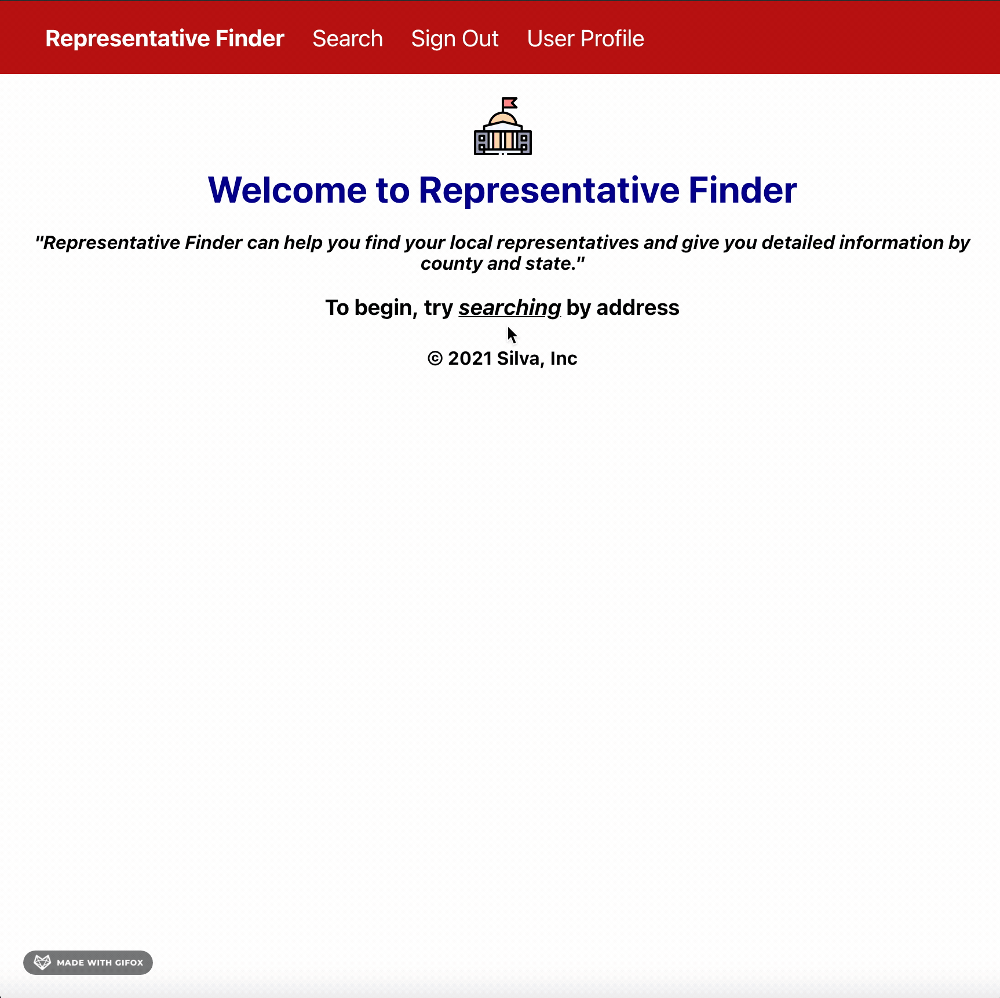

# Getting Started with Create React App

This project was This project was built with Boca Code [more info](https://www.bocacode.com). 

Simple react website built to find your local representatvies from a county to state level by inputting your address. 

- Login authenticated through Firebase
- Hosting through Firebase
- connected through sampleAPIs 

## Available Scripts

In the project directory, you can run:

### `npm start`

---
 

Check out demo of site:

